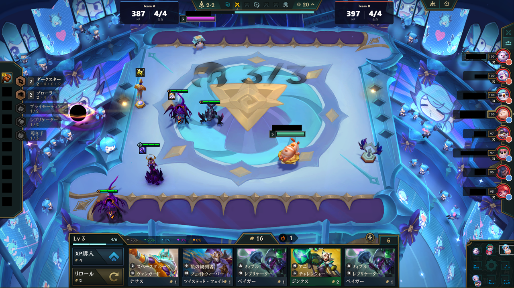

# 4v4WarsWatcher

**Teamfight Tactics（TFT）の 4v4 対戦を観戦するときに、両チームの状況をひと目で見られるオーバーレイです。**

観戦画面に、

- 各チームの **合計HP** と **生存人数**
- プレイヤーリストの各キャラに、どちらのチームか分かる **色マーカー／チームアイコン**

を重ねて表示します。実況・観戦・大会配信などで「今どっちのチームが優勢か」が直感的に分かります。

> 表示は解像度 **1920×1080** のTFT画面に合わせています。（画像はイメージです）

---

## できること

- 🟦🟥 **チームの見分け** … 各プレイヤーのキャラ横に、チーム色のマーカーや、自分でアップロードした**チームアイコン**を表示
- ❤️ **チーム合計HP** … 両チームの残りHP合計をリアルタイム表示（脱落したプレイヤーは0として計算）
- 🧍 **生存人数** … `生存/全体`（例: 3/4）を表示
- ⚙️ **かんたん設定** … チーム名・メンバー・チームカラー・アイコンをホーム画面から設定

---

## 必要なもの

- **Windows PC**
- **Overwolf**（無料。オーバーレイ表示に使用）
- **TFTを 1920×1080 で観戦**できる環境
- 初回だけ準備するソフト（どちらも無料）
  - **Python**（プレイヤー名とHPを画面から読み取るために使用）
  - **Tesseract-OCR**（HPの数字読み取りに使用）

> ⚠️ 現在はストア配布ではないため、初回のみ少しだけ手動セットアップが必要です。

---

## 使い方

1. アプリのホーム画面を開く
2. **歯車 ⚙** を押して、`worker` フォルダの場所（と必要ならTesseractのパス）を設定
3. **チーム名・メンバー（RiotID）・チームカラー・アイコン**を入力
4. TFTを**観戦開始** → 自動でオーバーレイが表示されます

メンバーは RiotID（`名前#タグ`）で登録します。アイコンは各チームに1枚、画像をアップロードして位置・拡大を調整できます。

---

## 名前がうまく表示されない時

画面の状況によっては、自動の名前読み取り（OCR）が外れることがあります。その時はホーム画面で手動補正できます：

- **プレイヤー対応** … 読み取った画像を見ながら、正しいプレイヤーを選んで割り当て
- **再OCR** … 読めなかった行をもう一度読み直す（行ごと／一括）
- **位置から登録** … 「上から○番目」のキャラ画像を見て、手動で名前を登録

落ち着いて画面が表示されているタイミングでこれらを使うと、ほぼ確実に直せます。

---

## うまくいかない時（よくある質問）

| 症状 | 対処 |
|---|---|
| Overwolfで「**Unauthorized App**」と出る | Overwolfに**ログイン**してから「Load unpacked」してください。ログイン切れが原因のことが多いです |
| HPや生存人数が出ない | ワーカー（Python）が起動しているか、`worker` フォルダのパス設定が正しいかを確認 |
| HPが読めない／0のまま | Tesseractがインストールされ、パスが通っているか確認 |
| マーカーの位置がズレる | TFTの解像度が **1920×1080** か、**ボーダーレス／ウィンドウ表示**かを確認 |
| 名前が一部出ない | 上の「名前がうまく表示されない時」を参照（手動で補正できます） |

---

## 注意

- **解像度 1920×1080 専用**です（プレイヤーリストの位置に合わせているため）
- TFTは**ボーダーレス／ウィンドウ表示**でご利用ください
- オーバーレイはゲーム画面に重ねて表示されます

---

開発・仕組みの詳細を知りたい方は `worker/README.md` も参照してください。
